# Scale AI Apps

To run the apps locally, please see [INSTRUCTIONS.md](./INSTRUCTIONS.md)

## 1. Product Reviews Modeling with Snowflake

This template app performs sentiment analysis and topic extraction on hundreds of thousands of product reviews stored in Snowflake. Business end users can use this app to create a focused search of product reviews, for example, to identify recent negative reviews and the specific entities (e.g. brands, products) that most frequently appear in them. Demand projections informed by the sentiment analysis can reduce buy-to-stock models in favour of a buy-to-order model.

Setup instructions [here](apps/snowflake-product/README.md).

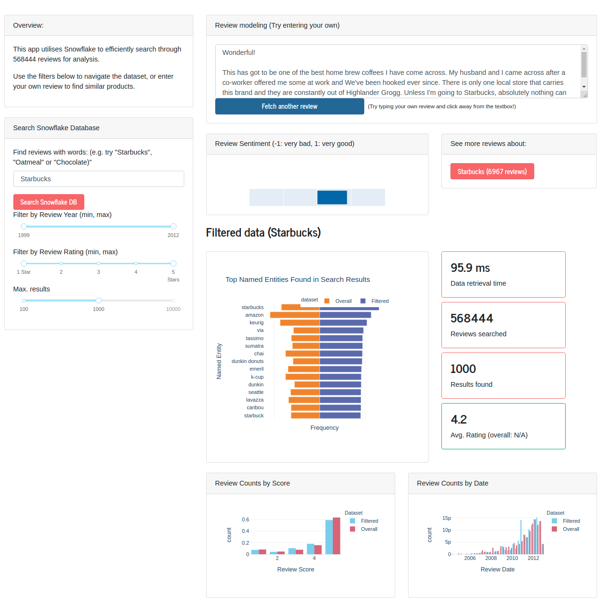

## 2. Steel Defect Segmentation

This template app allows end users to automatically segment defective surfaces from pictures of steel sheets. The heatmap view enables quality inspectors to quickly locate larger areas, and makes it easier to identify small defects that might have otherwise been missed. By incorporating open-source Dash Button and Download components, end users may save segmented images locally or to a database for supplier performance reporting.

The `steel_images` directory was retrieved from the validation split of the [NEU surface defect database](http://faculty.neu.edu.cn/yunhyan/NEU_surface_defect_database.html).

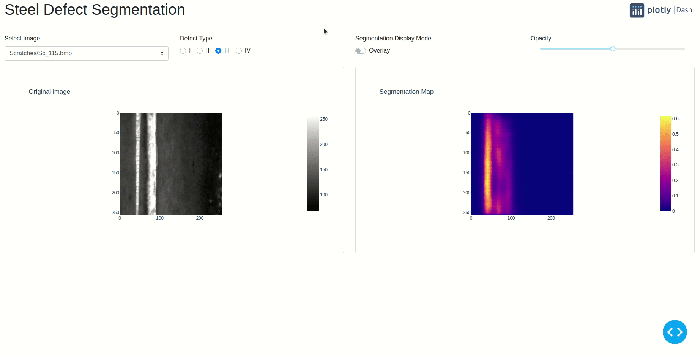

## 3. Garment Clustering and Visual Search

Retailers wishing to compare images of inventory within their collections or among competing brands may visually explore the similarity of different items. This template app applies the T-SNE dimension reduction algorithm on images from the open-source fashion MNIST dataset to visualize similarity between images and cluster similar images together, though end users can upload their own images. A convolutional neural network (CNN) trained with Keras predicts the class of each image.

Further details [here](apps/garment-clustering/README.md).

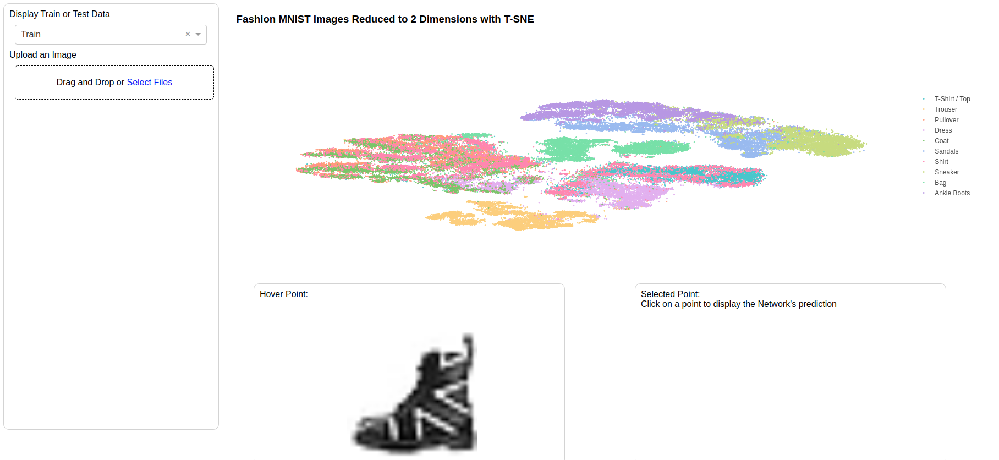

## 4. Geospatial Clustering

Business users often employ visual methodology to identify future points of sale based on regional demographic characteristics. This template app runs models created with pysal and scikit-learn, and applies spatial clustering and regionalization analysis to enable business and developer users to identify smaller, less evident clusters missed by visual inspection. This template app uses open-source AirBnB listings data, but clustering can be run on similar datasets including latitudinal/longitudinal and census demographic data to cluster stores by postal code and identify new target locations for establishing points of sale.

Further details [here](apps/dash-geospatial-clustering/README.md).

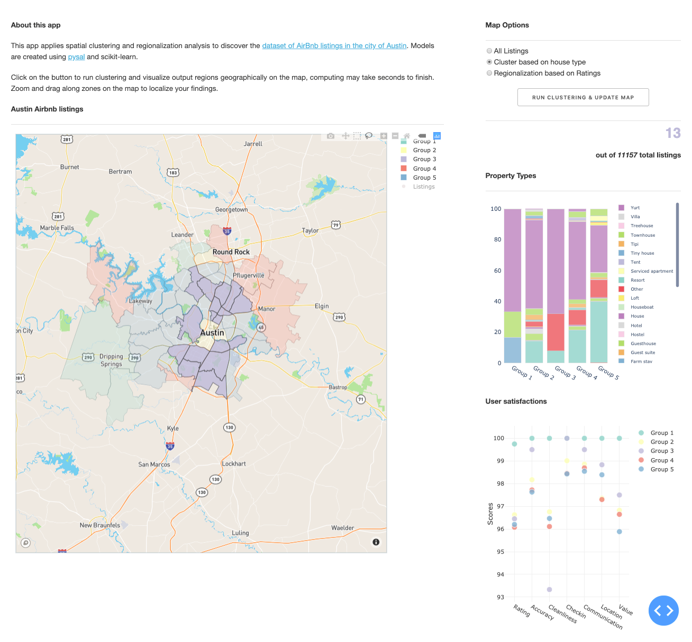

## 5. IOT Device Monitoring and Forecasting

This template app provides a dashboard view to monitor the online status of IOT devices in the production line, and implements an autoregressive model to forecast future percent of devices at risk of going down. The interval of status checks, as well as automated alerts set to specific thresholds, can be customized within the app’s source code.

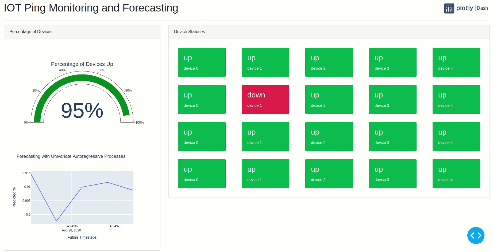

## 6. Detection Transformer

This template app allows end users to detect up to hundreds of different objects inside an image and efficiently draw out bounding boxes around each object. With this app, end users can automatically determine the count of each type of item inside a batch of images, enabling the automation and acceleration of inventory counting and verification processes.

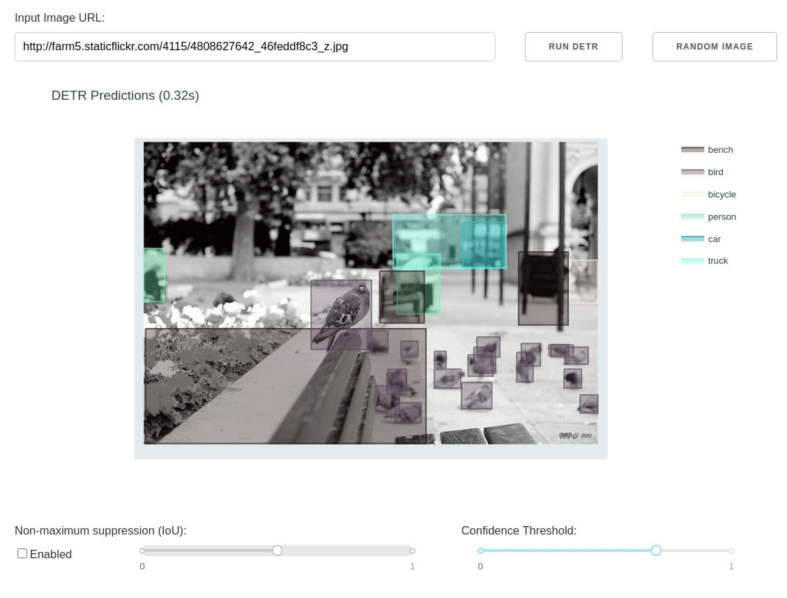

## 7. Dash Transport Route Analysis

This app uses an iterative route optimization algorithm to find optimal trajectories for delivery vehicles to arrive on time. The app allows analysts to review the automatically generated routes and derive insights on the efficiency of the routes and mitigate potential late arrivals. Furthermore, the app enables the application of more optimized route optimization algorithms, such as evolutionary algorithms and feature-based learning.

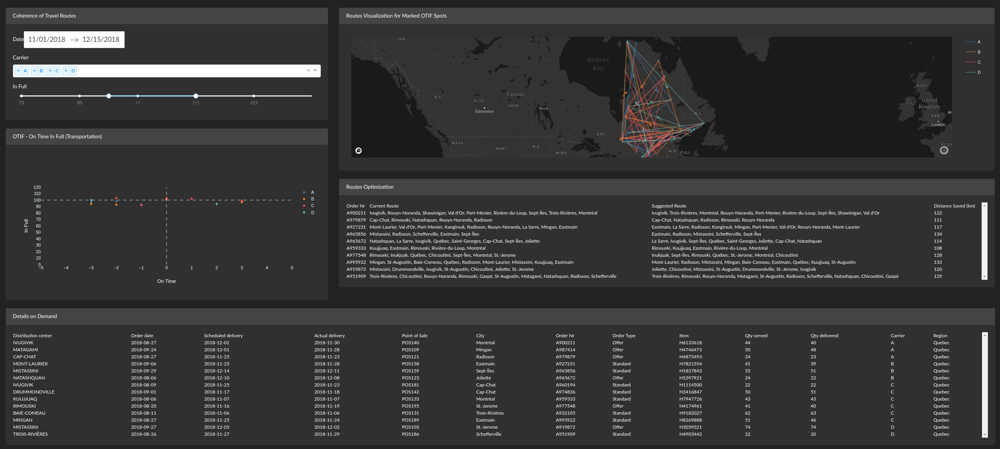

## 8. Transformer Maintenance Prediction

This template app allows the developer user to train various classifiers (Ridge, L-BFGS, SAGA, and SGD) in order to predict the risk of oil leakage for electricity transformers, helping distribution engineers identify and schedule transformer maintenance. The predicted risk is shown for the present, as well as many years in the future.

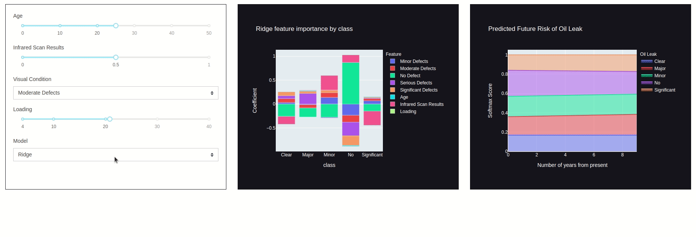

## 9. YOLO Real-Time Object Detection

This template app enables end users to compare the output of YOLO, an open-source, real-time object detection model, with human annotations. YOLO is advantageous as compared with classifier-based models, enabling predictions that are 1000x faster than models like R-CNN. The YOLO model is trained to accurately identify and annotate over 80 types of objects, however, end users wishing to train YOLO on their own data, such as production line images, must visually inspect the output to ensure accuracy in the context of their project. This application empowers that process and creates accessibility to non-technical members of the organization.

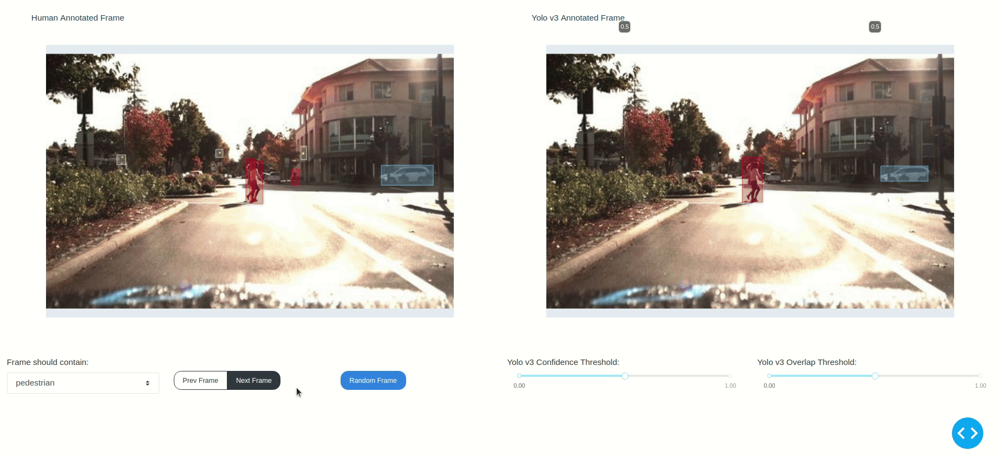

## 10. Bounding Box Classification

This template application facilitates the annotation of collected images, as from production lines or delivery routes, by proposing custom types and allowing data science users to quickly export the bounding box annotations for training image content classifiers.

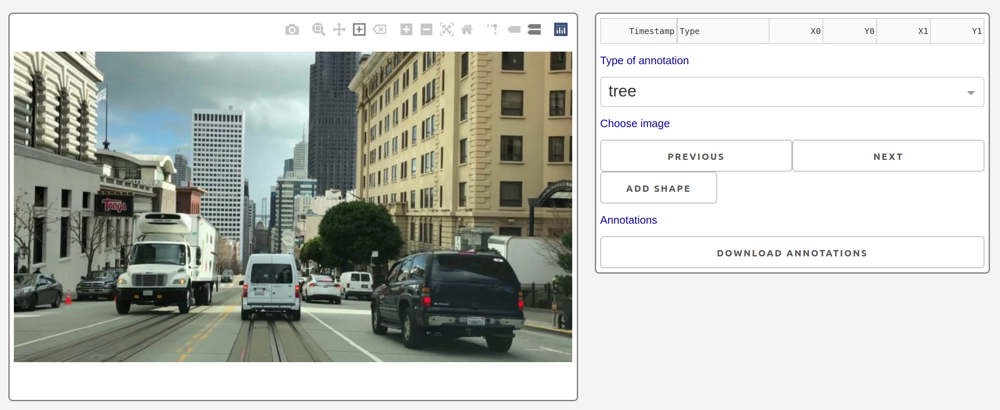

## 11. UMAP + NVIDIA Rapids.ai

This template app uses the UMAP algorithm to quickly project 100k+ data points into a 2D space. This can be done in just a few seconds using a Nvidia GPU. This app allows end users to visually inspect an incoming stream of purchase transactions data in real time allowing for faster, more informed decision-making and detection of outliers. Filters allow the end user to quickly narrow down groups of outliers, including time and amount of transaction.

Further details [here](apps/dash-cuml-umap/README.md).

## 12. Time Series Forecasting

Facebook's Prophet model is a powerful tool for time series forecasting, which can be used for a multitude of applications from regional sales predicting to electrical load forecasting. This template allows predictive analysis of regional values, for example to forecast future energy demand based on historical seasonal patterns in order to make informed decisions about the supply required for future months and hazards posed to equipment due to overload.

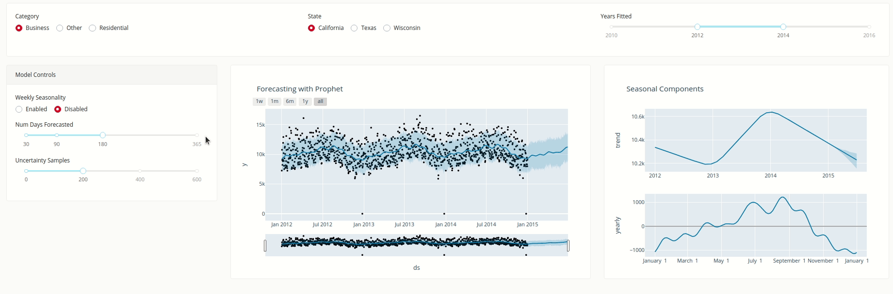

## 13. Live Model Training

This template app enables developer users to visualize in real-time core metrics of a Tensorflow convolutional neural network during training on image datasets. Visual debugging and monitoring of a model's accuracy and loss during training can enable developer users to more quickly develop models for processing image datasets, for example, to identify parts defects or classify inventory within their supply chains. App documentation guides developer users on testing and validating their own model and data in the app.

Further details [here](apps/dash-live-model-training/README.md).

## 14. Dash Explainable AI with SHAP

This "explainable AI" app provides a template for visually explaining the impact of different features in a data set on the output of a predictive model. Data science teams will find this application useful for illustrating the driving factors behind their models, e.g., predicting likelihood of device failure, predicting demand for a certain item or inventory category. In this example, developer users may provide their own model and inputs, and business users may specify custom inputs in the left panel. Outputs will be reflected in the bar graph, illustrating how each feature drives the model output in a negative or positive direction. This template app uses open-source data to predict payment amounts based on the payer's features.

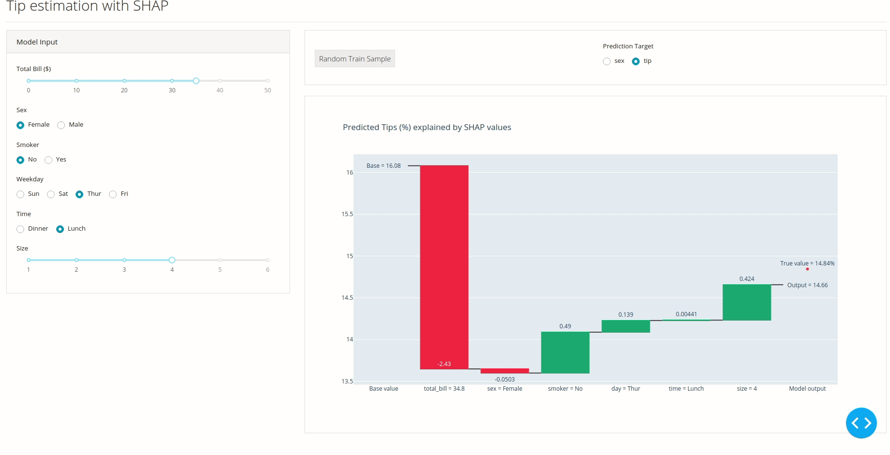

## 15. Object Detection Explorer (two apps)

This template app uses Google MobileNets, a mobile-first computer vision model designed for use on mobile devices or embedded applications. This app uses open-source videos, but end users can reference the app documentation to generate data of objects detected for each frame of their own footage, and generation of output video with bounding boxes. The app is ideal for cases requiring the interpretation of fast-paced footage with numerous and differing object classifications (e.g., unsorted objects on a conveyor belt), due to helper visualizations in the right-side panel, such as confidence levels displayed in heatmap form.

Further details [here](apps/dash-object-detection/README.md).

The R version is located [here](apps/dashr-object-detection).

## 16. Car Features Explorer with t-SNE

This template app uses T-SNE dimensionality reduction to create an accurate visual representation of vehicles clustered by their categorical features, which are listed in the table to the right of the graph. Vehicle models with features similar to each other are located closer together on the plot. End users wishing to quickly and visually identify groups of products (in this example, vehicles) with similar components (such as fuel-type, manufacturer, etc.), for example in order to identify products impacted by a certain risk, can run the T-SNE model on their own data using this application.

Dataset was retrieved from [this dataset](https://www.kaggle.com/austinreese/craigslist-carstrucks-data). To get `vehicles_preprocessed.csv`, please see `preprocess.py`.

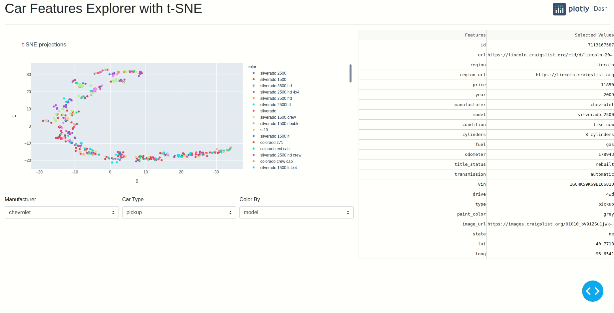

## 17. LDA Network Graph for Textual Data

End users wishing to identify and analyze patterns between textual descriptions of hundreds of co-purchased items can use this model and accompanying visualization to better understand consumer behaviour and create new product bundles based on these patterns. This template app applies T-SNE and Dash Cytoscape to display outputs of the natural language processing model, latent dirichlet allocation (LDA). For this app, the LDA model was run on a dataset of thousands of documents, categorizing them by topic. The network graph displays the relationships (references) between documents.

Further details [here](apps/dash-cytoscape-lda/README.md).

## 18. Ratings Modeling with Snowflake

This template app allows developer users to query and train a ridge regression model to predict a specific value, such as risk level assigned to a supplier or client, based on historical characteristics of that entity queried from a database. A calibration plot enables developer and business users alike to interpret the accuracy of the model and see which characteristics are most impactful towards the risk assignment.

Setup instructions [here](apps/ratings-modeling-snowflake/README.md).

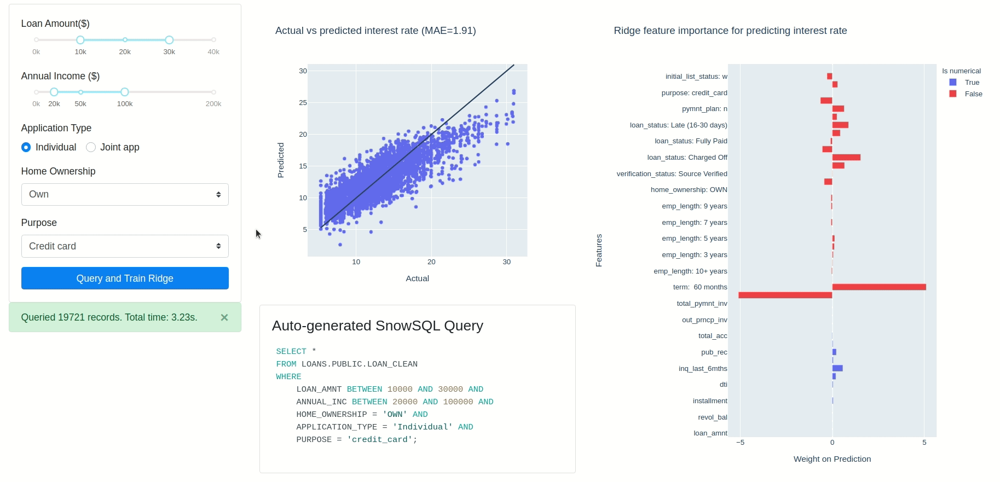

## 19. Word Embeddings Arithmetic

This word embeddings template app accepts textual input, such as garment descriptions, and embeds words into meaningful vectors, which are useful for reducing high-dimensionality in textual data. End users can apply word embeddings to predict future demand by comparing textual descriptions of historically or seasonally in-demand items against planned or upcoming inventory descriptions to find textually similar descriptions in the current/planned inventory.

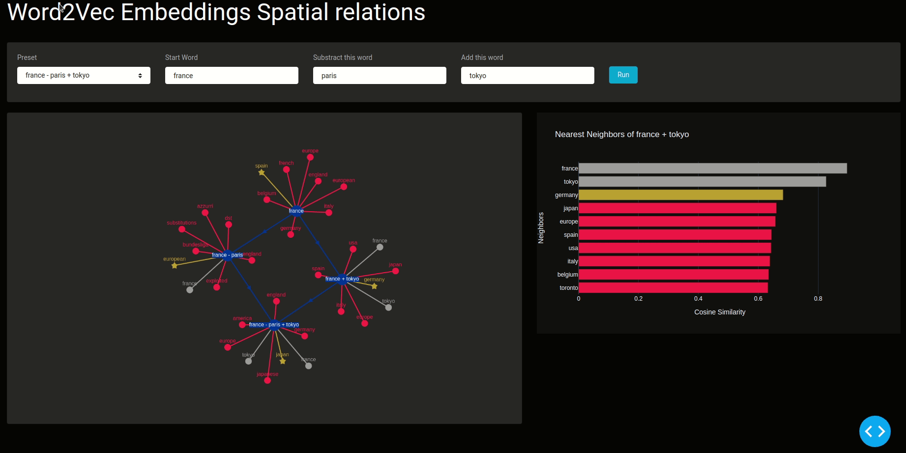

## 20. Dash Support Vector Machines (two apps)

This template app allows developer users to fully customize the parameters of the popular Support Vector Machine Classifier on two-dimensional numerical data, which is useful for classifying whether an item will pass quality assurance based on scalar characteristics automatically collected by a sensor (e.g. the weight, the opacity, the size, etc.).

Further details [here](apps/dash-svm/README.md).

The R version is located [here](apps/dashr-svm).

## 21. Dash Optical Character Recognition

This template app enables the conversion of handwritten supplier invoices and other written data into machine-readable data through optical character recognition. Developer users may implement an upload component to allow input of scanned image data and translation into textual format for further processing.

Further details [here](apps/dash-canvas-ocr/README.md).

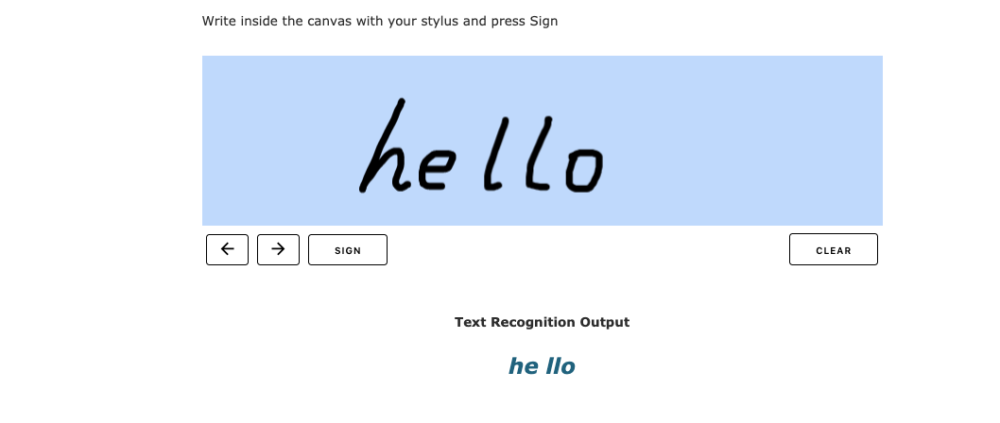

## 22. Dash Summarization

This template app utilizes the DistilBART model to automatically summarize textual data input such as social media and customer reviews. The app is particularly useful when implemented modularly as a component within larger NLP sentiment analysis of customer complaints or product reviews, where developer users run the model on longer texts but business users prefer shorter views.

## 23. Dash Image Processing

Developer users working with object recognition models can use this template app to upload custom images and apply various image processing techniques such as filtering and enhancements. This is useful for improving the quality of images automatically taken on production lines or for retail inventory cataloging, and is an important step for training object recognition models. Developer users can add custom filtering and enhancements (e.g. super-resolution) by modifying the source app.

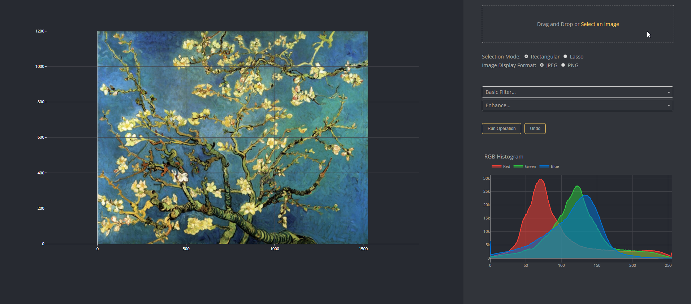

## 24. Dash Bar Chart Generation

This template app provides a plain-language interface for business users to access bar chart views of customer complaint summaries, product review analyses, explainable AI reports, and other outputs from their data science teams. Business users not well versed in Python can textually describe the chart view they want, which is automatically generated and displayed in real time by the app.

Further details [here](apps/dash-gpt3-bars/README.md).

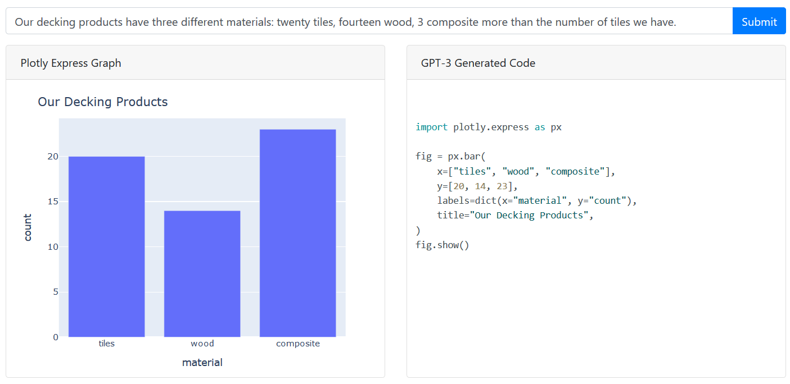

## 25. Dash Line Chart Updater

This template app provides a plain-language interface for business users to access line chart views of model training accuracy, time series forecasts, and other outputs from their data science teams. Business users not well versed in Python can textually describe the chart view they want, which is automatically generated and displayed in real time by the app.

Further details [here](apps/dash-gpt3-lines/README.md).

## 26. Dash Neural Machine Translation

In the wake of Covid-19, diversification of procurement operations can lead to a large influx of textual descriptions in new languages. To prepare this textual data for further processing, such as with word embeddings for demand prediction, this template app utilizes the MarianMT neural machine model to automate machine translation of textual data before verification.

## 27. Customer Complaints NLP

This template app interactively visualizes the results of natural language processing (NLP) on customer complaint textual data. Data science users running latent dirichlet allocation (LDA) and T-SNE models on their own textual data may utilize this template to share results with business end users. End users can explore the frequency and relationship of words and concepts within customer complaints to see, for example, which words or phrases are associated with lengthy complaints, which words or topics appear together, and which accounts/products/entities generate the most complaints. Topic clusters identified can be further fed into regression models targeting SKU availability and demand.

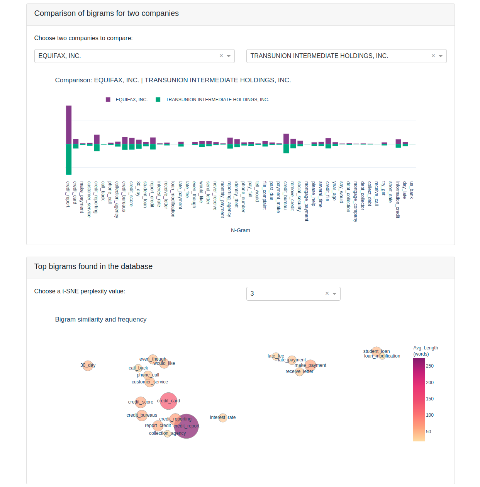

## 28. Customer Review Rating Analysis

This template app enables business users to make faster inventory purchasing decisions by filtering large datasets of customer reviews by various customer segments and based on the product purchased. The app will display each individual review along with the predicted ratings, as well as a score distribution to convey the confidence of the model for each given rating. The ratings are predicted using a Logistic Regression trained on past ratings data and scripts are provided to train the model.

To train or preprocess the data from scratch, you will need to download [the dataset from kaggle](https://www.kaggle.com/jessicali9530/kuc-hackathon-winter-2018?select=drugsComTrain_raw.csv), and place the content inside `apps/review-analysis`.
To generate the `new_reviews.csv` and `old_reviews.csv` files, see `preprocess_test.py`. For model training, see `train_model.py`.

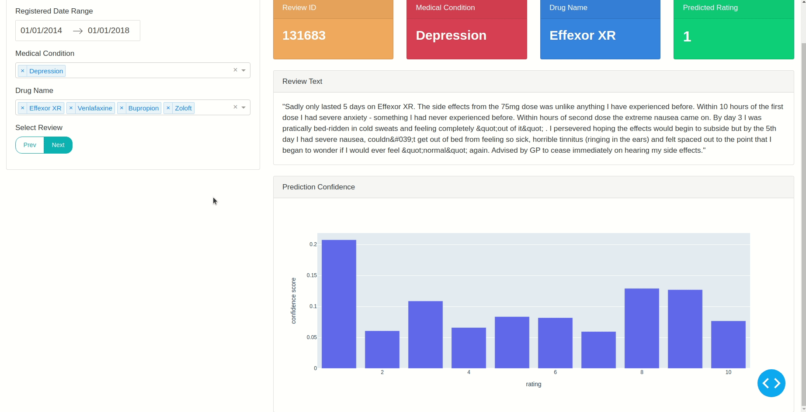

## 29. Logistic Rule Regression Prediction

With this template app, end users can utilize a directly interpretable supervised learning method that performs logistic regression in order to predict, for example, whether a store will run out of stock based on descriptive features defined by developer users as rules such as “hours of operation are greater than X, geographic location is one of Y.”

Further details [here](apps/logistic-rule-regression/README.md).

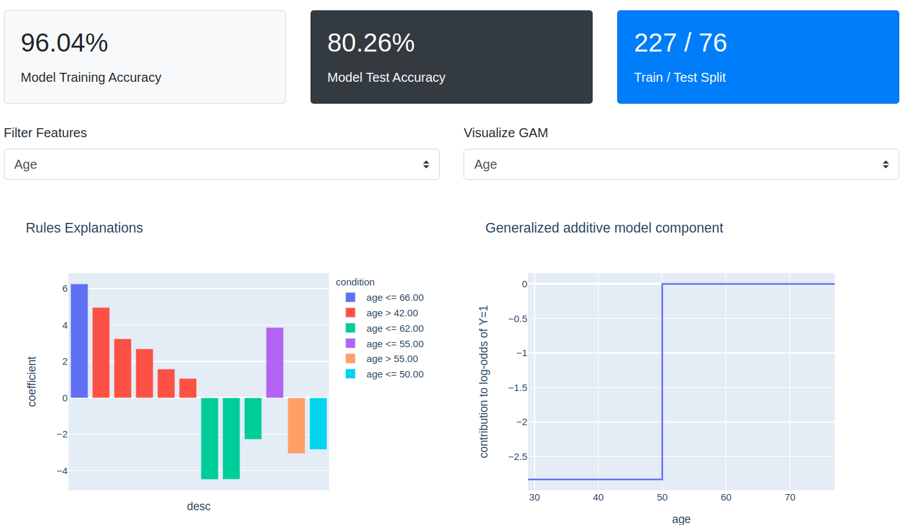

## 30. Explainable Decision Tree

This template app shows how to query data from a Snowflake Data Warehouse and train and analyze a classification model using Dash. The model can predict a supply chain risk classification based on multiple characteristics in the data, such as supplier susceptibility to environmental factors, and SQL and Scikit-Learn are used to provide real-time decision trees explaining how the risk level was calculated. A visual explorer in the right panel helps end users understand why the decision tree made a certain decision.

Setup instructions [here](apps/explainable-decision-tree/README.md).

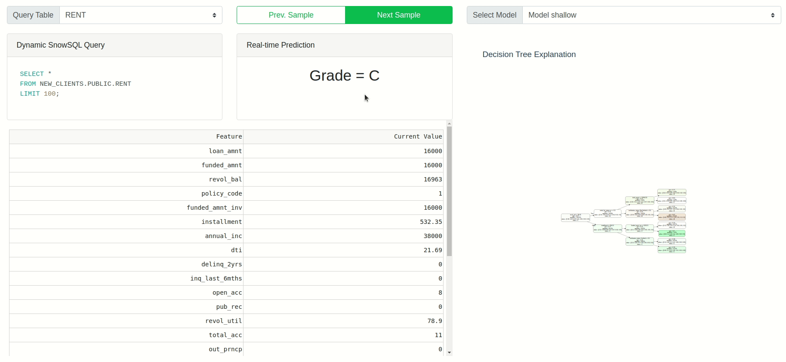
