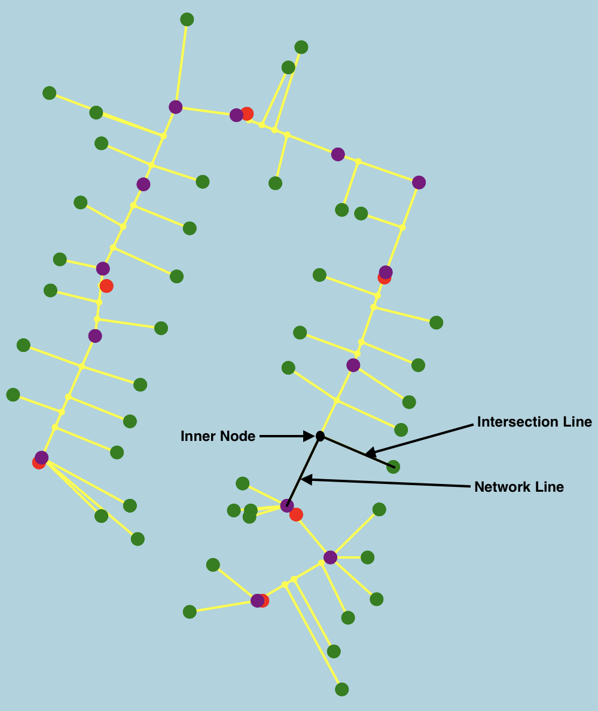
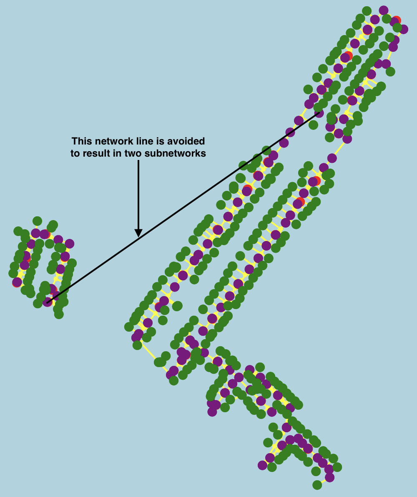
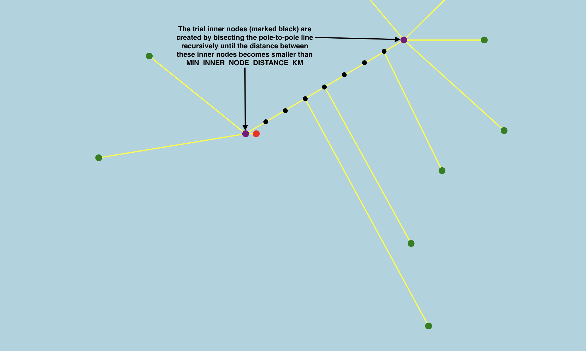

# Dash Cytoscape: Leaflet, Context Menu & Algorithim

Dash Cytoscape leaflet and context menu features and an algorithim to predict voltage network node locations. Built in collaboration with Plotly, SCALEAI, and developed by Zyphr.

Dash Cytoscape: https://github.com/plotly/dash-cytoscape

## How to Run

1. Install `Python 3.9.2`: https://www.python.org/downloads/release/python-392/
2. Install requirements: `pip install -r requirements.txt`
2. Run one of the three `app` files. Ex: `python app-cytoscape.py`

## File Directories

```
|   app: Dash Cytoscape demo
|   requirements.txt: Dependencies
|   README.md: Documentation
|   dash_cytoscape: Dash Cytoscape library containing the Leaflet and context menu features
\---utils: Voltage network algorithim
    |   algorithm.py
    |   classes.py
    |   constants.py
    |   helpers.py
    |
    \---graph
            cytoscape.py
            plotly.py
```

## Voltage Network Dataset

The app expects the .csv data to have the following columns:
- id - unique id in the format `"{letter}{number}"`, where the `letter` is one of `["t", "p", "cp"]` respective to point type, and the `number` is some integer
- point type - one of `["transformer", "pole", "connection point"]`
- lat - latitude of point
- lon - longitude of point
- root node - the id of the transformer it is connected to (only defined for connection points)

In `utils/constants.py`, you can update `DATA_PATH` to specify which data file the app will use. We have the following example data files in the [data](data) directory:
- `data/data.csv` - one subnetwork
- `data/data2.csv` - two subnetworks
- `data/data3.csv` - three subnetworks

If you run the app with the `data/data2.csv` or `data/data3.csv`, you'll notice disjoint clusters which we refer to as subnetworks.

## How the Algorithm Works

This algorithm was created to predict voltage network location approximations.

The algorithm works by taking a set of provided nodes and dividing these nodes into different groups called subnetworks. It draws a skeleton of lines between the Poles of each subnetwork and connects all the Transformers and their Connection Points to their respective subnetwork.

### Constants

In `utils/constants.py`, we have defined global constants to be used in the algorithm:
- `EARTH_RADIUS_KM = 6373.0`
- `MIN_INNER_NODE_DISTANCE_KM = 0.006`
- `MAX_INNER_NODE_DISTANCE_KM = 0.2`

### Classes

In ``utils/classes.py`, we have defined classes to represent the network in terms of nodes and lines, or rather `Node` and `Line` objects. The `Node` class is further extended into child classes `Transformer`, `Pole`, `ConnectionPoint` and `InnerNode` to represent the different types of nodes.

### Functions

In `utils/algorithm.py`, we have defined functions to transform the given data into a network of nodes and lines:

`make_nodes_from_dataframe(transformers poles)` takes in the dataframe and transforms the rows into `Transformer`, `Pole` and `ConnectionPoint` objects depending on type. `ConnectionPoint` objects are further grouped by their root node (transformer that they are connected to) to define the `.leaf_nodes` for each `Transformer` object. These are returned as three separate lists of `Transformer`, `Pole` and `ConnectionPoint` objects, i.e. `list[Transformer]`, `list[Pole]`, `list[ConnectionPoint]`.

`make_network(df)` takes in two separate lists of `Transformer` and `Pole` objects, to compute:
- network lines - a path of lines connecting poles and inner nodes
- intersection lines - lines joining somewhat perpendicularly from leaf nodes (transformers and connection points) to nodes along the path of network lines (inner nodes and poles)
- inner nodes - the nodes between poles, where leaf nodes intersect along the path of network lines

Note that these computed nodes and lines are ultimately divided by subnetwork, i.e. `list[list[InnerNode]]` or `list[list[Line]]`. What separates a subnetwork from another subnetwork is the large length of the line that would connect the subnetworks if they were connected, i.e. if the length is greater than `MAX_INNER_NODE_DISTANCE_KM`.

<p float="center">
  
   
</p>

We can divide this algorithm into the following stages:

**Stage 1: We traverse poles by proximity, creating trial inner nodes along the traversed path for leaf nodes to later intersect at and grouping these trial nodes (trial inner nodes and poles) by subnetwork.**

Starting with the pole that has minimum latitude, we traverse the poles by proximity. At every pole, we compute the distance from the last traversed pole. If the distance is larger than `MAX_INNER_NODE_DISTANCE_KM`, we acknowledge the current list of trial nodes as a complete subnetwork, by appending it to a list of subnetworks, and restart the list for the next subnetwork. Every time this occurs, we recompute a new starting pole for the next subnetwork out of the untraversed nodes. However, if the distance between the poles is smaller than `MAX_INNER_NODE_DISTANCE_KM`, we compute the "trial" inner nodes between the poles and extend the current list of trial nodes with these trial inner nodes and the current pole. 

Note that we create a temporary `Line` object to compute the distance or trial inner nodes between two poles, since the `Line` class has functions `.distance()` or `.intermediate_nodes()`. The trial inner nodes are computed by bisecting the line between the poles recursively until the distance between the inner nodes hits the `MIN_INNER_NODE_DISTANCE_KM` limit.



**Stage 2: We create intersection lines from leaf nodes (transformers and connection points) to trial nodes (trial inner nodes and poles).**

For every transformer, we first find the closest subnetwork to limit any future searches to the subnetwork instead of the entire network. Recall the connection points were grouped as `.leaf_nodes` under their `Transformer` object. So for every leaf node (including the current transformer), we create an intersection line between the leaf node and the closest node among the trial nodes for that subnetwork. This gives us `grouped_intersection_lines`.

Note that every node has a boolean `.used` attribute to acknowledge whether they are used in the network. By default, this is set to `True` for all `Transformer`, `Pole` and `ConnectionPoint` objects, and `False` for all `InnerNode` objects since they are initially on "trial". So when know that an `InnerNode` object will be used in the network (i.e. for an intersection line), we set the `.used` attribute to `True`. This is needed for the next step.

**Stage 3: We create network lines between valid inner nodes and poles.**

For each subnetwork, we traverse through the trial nodes that we defined at **Stage 1**. For every trial node that has the `.used` attribute to `True`, we create a network line between the current and last traversed node. If this trail node is also of type `InnerNode`, we store this node as an inner node for that subnetwork. This gives us `grouped_network_lines` and `grouped_inner_nodes`.
