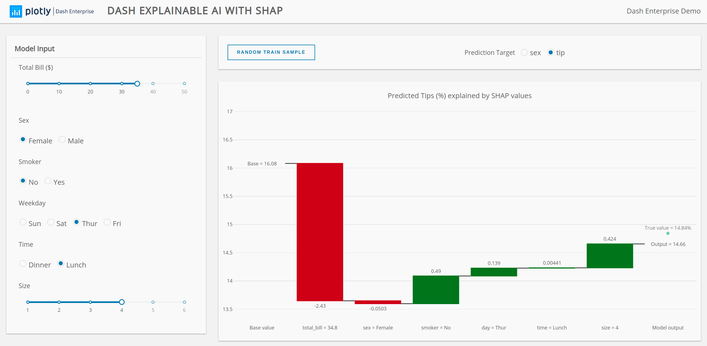

# Dash Explainable AI with SHAP

This demos uses the tips dataset. Given a set of features about customers (Which can be controlled in the side bar), you can train a LightGBM model to predict what % of tips or what the sex of the customer is. Additionally, you can visualize the additive effect of each feature computed by SHAP.

[Click here for demo](https://dash-gallery.plotly.host/dash-shap-tips/), and check out the Medium article for more information.




## Instructions

To get started, first clone this repo:

```
git clone https://github.com/plotly/dash-teaser-apps.git
cd dash-teaser-apps/apps/dash-shap-tips
```

Create and activate a conda env:
```
conda create -n dash-shap-tips python=3.7.6
conda activate dash-shap-tips
```

Or a venv (make sure your `python3` is 3.6+):
```
python3 -m venv venv
source venv/bin/activate  # for Windows, use venv\Scripts\activate.bat
```

Install all the requirements:

```
pip install -r requirements.txt --extra-index-url https://dash-gallery.plotly.host/Docs/packages/
```

You can now run the app:
```
python app.py
```

and visit http://127.0.0.1:8050/.
